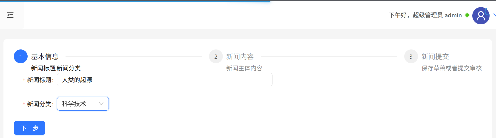
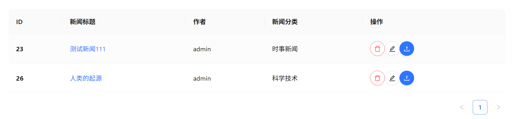
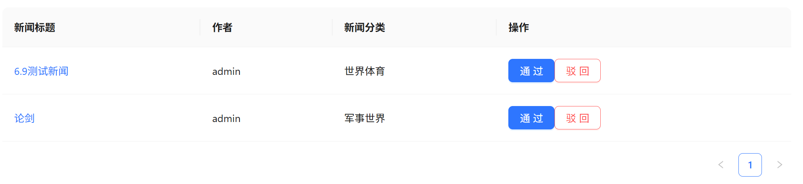
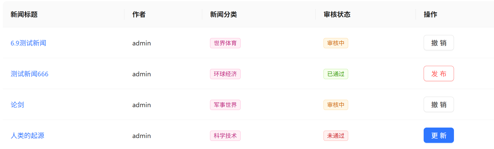

# React 新闻管理系统项目
## 前言
本项目接口和灵感来源于千峰教育的Kerwin老师教学,但是在其基础上,更新了routesV6版本的路由,以及其他的技术,例如react-quill富文本编辑器等技术,如果大家想要学习这个项目的话,可以结合B站上kerwin老师的React教学视频,如果您觉得这个项目不错,帮忙点一个Star,这对我帮助很大,谢谢!


## 一、项目简介
本项目是一个功能完备的基于 React 的新闻管理系统，融合了用户管理、权限管理、新闻发布与审核等核心功能。采用 React 18 与 React Router v6 等前沿技术，结合 Ant Design 组件库，打造出简洁易用且美观的界面。使用 JSON Server 模拟后端数据，极大地方便了开发与测试流程。同时，项目在性能优化、状态管理、路由控制等方面进行了精心设计，以提供高效稳定的用户体验。


## 二、项目功能
### 1. 用户管理
- 支持不同角色（超级管理员、区域管理员、编辑）的用户登录，通过严格的权限控制确保系统安全。
- 用户列表展示功能强大，可按区域、角色名称等多条件灵活筛选，方便管理员快速定位所需用户。
- 提供用户状态（启用/禁用）的切换操作，便于对用户进行管理。
- 支持用户的添加、删除和更新操作，满足系统用户信息动态管理的需求。


### 2. 权限管理
- 角色列表清晰展示，可对角色进行删除和权限编辑操作，实现对角色权限的精细化管理。
- 权限列表详细呈现，可对权限进行删除和页面开关设置，确保系统功能的访问权限得到合理控制。


### 3. 新闻管理
- 新闻的添加、编辑和删除操作简单便捷，支持新闻草稿的保存和提交审核，方便编辑人员进行新闻创作。
- 具备新闻的审核与驳回操作，审核人员可根据新闻内容进行快速处理。
- 支持新闻的发布和撤销发布操作，可实时控制新闻的展示状态。
- 提供新闻的预览和详情展示功能，方便用户在发布前确认新闻内容。


")



### 4. 审核管理
- 提交后的新闻，需要在审核管理中进行审核。
- 支持通过与驳回，并且在列表中可见并进行后续操作。





### 5. 发布管理
- 审核后的新闻，需要在发布管理中进行操作。


### 6. 游客浏览
- 游客可以直接浏览新闻列表和详情，无需登录即可获取新闻信息。


## 三、项目结构
```
src
├── components
│   ├── sandbox
│   │   └── NewsRouter.js
│   └── user-manage
│       └── UserForm.js
├── router
│   └── IndexRouter.js
├── store
│   └── store.js
├── util
│   └── http.js
├── views
│   ├── login
│   │   └── Login.js
│   ├── news
│   │   ├── Detail.js
│   │   └── News.js
│   └── sandbox
│       ├── audit-manage
│       │   ├── Audit.js
│       │   └── AuditList.js
│       ├── home
│       │   └── Home.js
│       ├── news-manage
│       │   ├── NewsAdd.js
│       │   ├── NewsDraft.js
│       │   ├── NewsCategory.js
│       │   ├── NewsPreview.js
│       │   └── NewsUpdate.js
│       ├── nopermission
│       │   └── Nopermission.js
│       ├── publish-manage
│       │   ├── Unpublished.js
│       │   ├── Published.js
│       │   └── Sunset.js
│       ├── right-manage
│       │   ├── RoleList.js
│       │   └── RightList.js
│       └── user-manage
│           └── UserList.js
├── App.js
├── App.test.js
├── index.css
└── index.js
```

## 四、技术栈
### 前端框架
- **React 18**：作为核心前端框架，提供高效的虚拟 DOM 渲染和组件化开发模式，确保应用的高性能和可维护性。
- **React Router v6**：负责应用的路由管理，实现单页面应用（SPA）的路由切换和导航功能。

### 状态管理
- **Redux**：用于管理应用的全局状态，通过单向数据流和纯函数的 reducer 实现状态的可预测性和可维护性。
- **Redux Toolkit**：简化 Redux 的配置和使用，提供了如 createSlice、createAsyncThunk 等实用工具，提高开发效率。

### 组件库与插件
- **Ant Design**：提供丰富的高质量 UI 组件，遵循统一的设计规范，使项目界面美观、易用且具有一致性。
- **NProgress**：轻量级的进度条插件，在页面加载和数据请求时提供视觉反馈，提升用户体验。
- **echarts**：可视化图表，加入了柱状图饼状图等图表来使得数据可视化 。
- **react-quill**：使用 react-quill 富文本编辑器，支持新闻的添加、编辑和删除操作，支持新闻草稿的保存和提交审核，方便编辑人员进行新闻创作。

### 数据模拟与交互
- **JSON Server**：在开发阶段模拟后端 API，提供数据存储和接口服务，方便前端开发和测试。
- **Axios**：基于 Promise 的 HTTP 客户端，用于发送 HTTP 请求，与后端 API 进行数据交互。

### 样式处理
- **CSS Modules**：局部作用域的 CSS，避免全局样式冲突，提高样式的可维护性。
- **SCSS**：CSS 的预处理器，提供变量、嵌套、混合等高级特性，增强 CSS 的编写能力。

### 日期处理
- **Moment.js**：强大的日期处理库，提供丰富的日期格式化、计算和操作方法。

### 测试与性能优化
- **Jest**：JavaScript 测试框架，用于编写单元测试和集成测试，确保代码的质量和稳定性。
- **React Testing Library**：用于测试 React 组件，模拟用户交互和验证组件行为。

### 路由与导航
- **React Router v6**：实现单页面应用的路由管理，支持动态路由、嵌套路由和路由守卫等功能。

## 五、环境准备
- **Node.js**：确保已经安装 Node.js（推荐版本 14.x 及以上）。
- **npm 或 yarn**：用于安装项目依赖。

## 六、安装与运行
### 1. 克隆项目
```bash
git clone https://github.com/LooYee1/Backend-Manage-System
cd Backend-Manage-System
```

### 2. 安装依赖
```bash
npm install
# 或者使用 yarn
yarn install
```

### 3. 启动 JSON Server
```bash
npx json-server --watch db.json --port 5000
```

### 4. 启动前端项目
```bash
npm start
# 或者使用 yarn
yarn start
```

### 5. 访问项目
打开浏览器，访问 `http://localhost:3000`。

## 七、配置说明
### 1. 后端接口地址
项目使用 JSON Server 模拟后端接口，接口地址为 `http://localhost:5000`。如果需要修改后端地址，可以在 `src/util/http.js` 中进行配置。
```javascript
import axios from 'axios';

axios.defaults.baseURL = "http://localhost:5000";
```

### 2. 路由配置
路由配置文件为 `src/router/IndexRouter.js` 和 `src/components/sandbox/NewsRouter.js`，可以根据需要修改路由规则。
```javascript
import React from "react";
import { HashRouter, Route, Routes } from "react-router-dom";
import Login from "../views/login/Login";
import NewsSandBox from "../views/sandbox/NewsSandBox";
import Detail from "../views/news/Detail";
import News from "../views/news/News";
import { Navigate } from 'react-router-dom';

export default function IndexRouter() {
    return (
        <Routes>
            <Route path="/login" element={<Login />}></Route>
            <Route path="/news" element={<News />}></Route>
            <Route path="/detail/:id" element={<Detail />}></Route>
            <Route path="*" element={<NewsSandBox />}></Route>
        </Routes>
    );
}
```

### 3. 权限配置
权限信息存储在 `localStorage` 中，根据用户角色动态显示不同的路由和操作按钮。可以在 `src/components/sandbox/NewsRouter.js` 中修改权限验证逻辑。

## 八、注意事项
- 项目使用 JSON Server 模拟后端数据，数据存储在 `db.json` 文件中。在开发过程中，对数据的修改会直接影响该文件。
- 项目中的用户登录信息存储在 `localStorage` 中，在实际生产环境中需要使用更安全的方式进行存储和验证，如使用 HTTP 头的 Authorization 字段或 JSON Web Token（JWT）。
- 确保在开发和测试过程中，JSON Server 和前端项目同时运行，以保证数据交互正常。

## 九、贡献指南
如果你想为项目做出贡献，可以按照以下步骤进行：
1. Fork 项目仓库。
2. 创建新的分支：`git checkout -b feature/your-feature`。
3. 提交代码并推送：`git push origin feature/your-feature`。
4. 提交 Pull Request。

## 十、许可证
本项目采用 [MIT 许可证](LICENSE)。